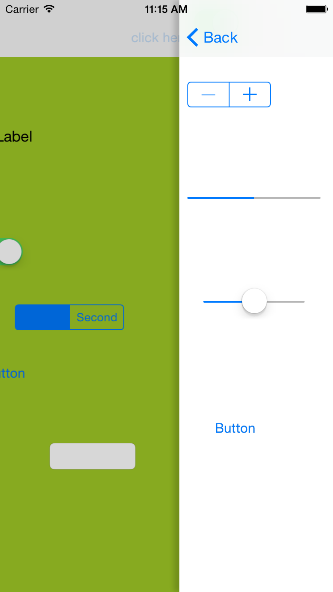

# SwipeNavigationVC
#向右滑动退出栈顶控制器
####说明：本版本有如下特性：
#####1.向右直接可返回上一级页面。
#####2.整体滑动十分自然流畅。
#####3.对性能做了一定的优化。
#####4.支持iphone6 Plus及横屏竖屏。
#####5.使用autoLayout布局，理论上支持所有屏幕。
#####6.增加了阴影，让界面看起来很有层次感。
----
####使用方法：
#####直接继承即可。
----
####效果图：

